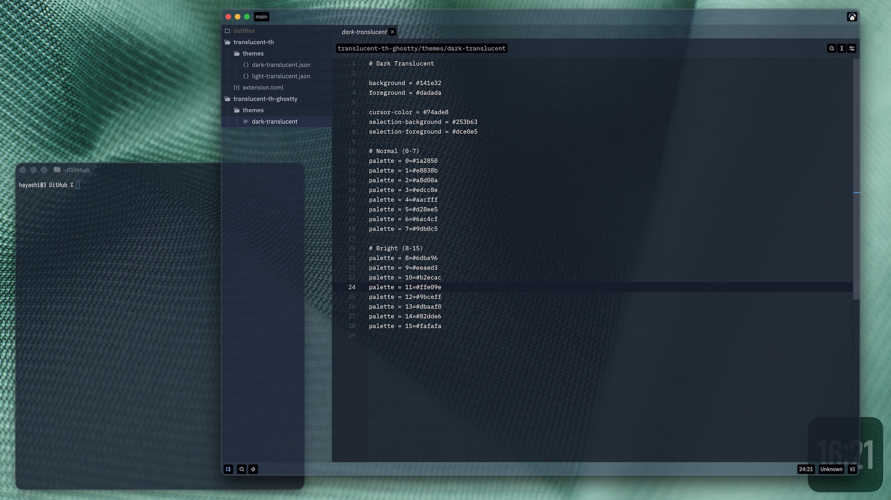
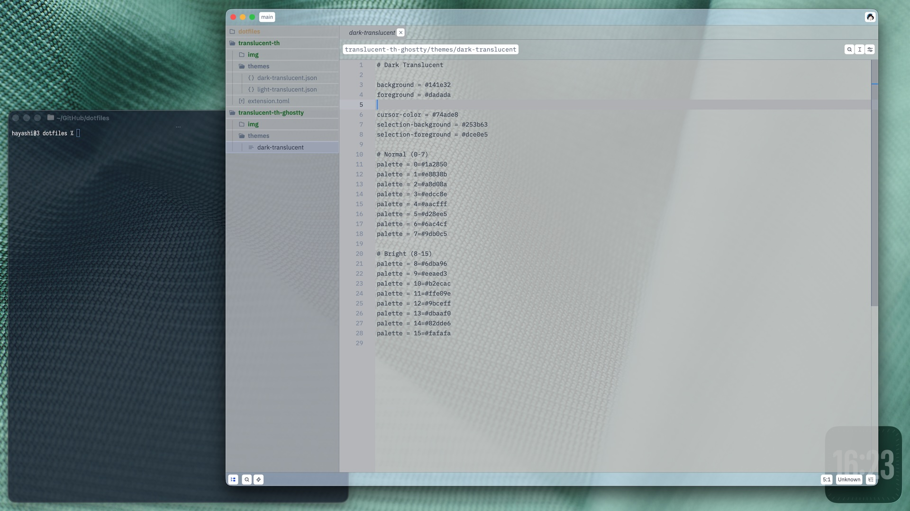

# Translucent Theme for Zed

A dark and light translucent theme for [Zed](https://zed.dev).

## Screenshots

### Dark Translucent



### Light Translucent



## Installation

Search for **Translucent** in the Zed Extensions marketplace, or add it to your `settings.json`:

```json
{
  "theme": "Dark Translucent"
}
```

```json
{
  "theme": "Light Translucent"
}
```
